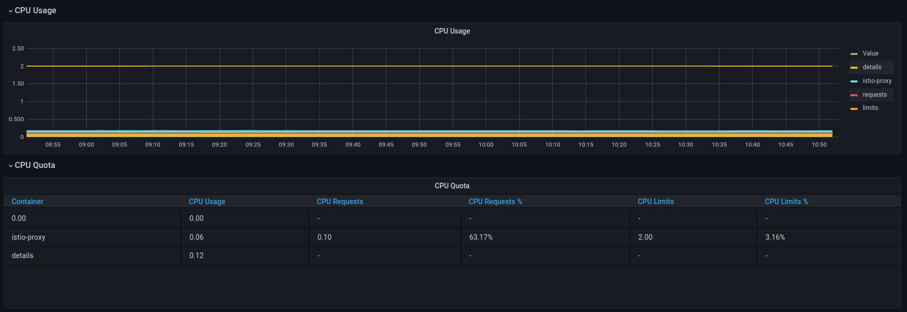
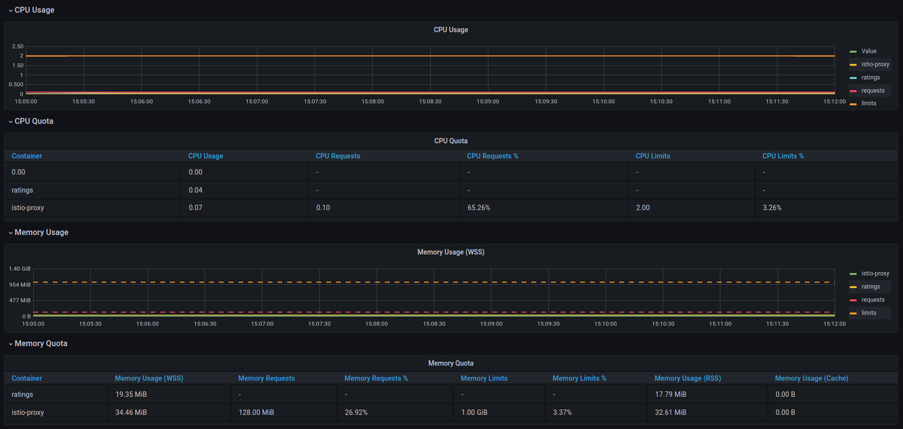
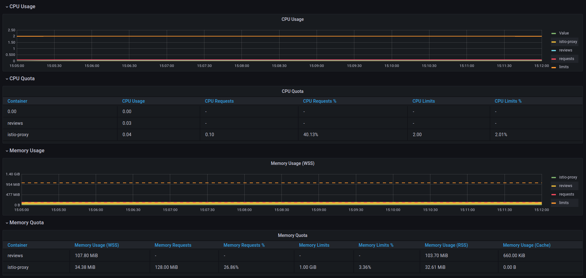
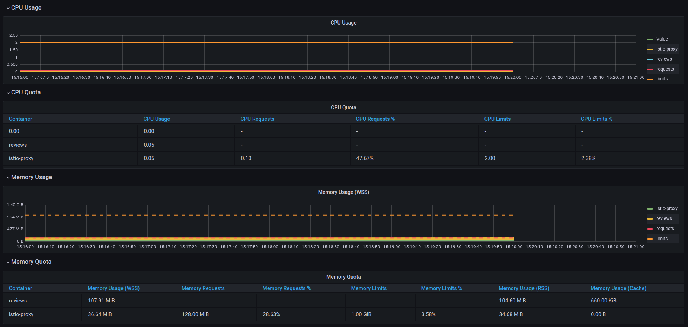
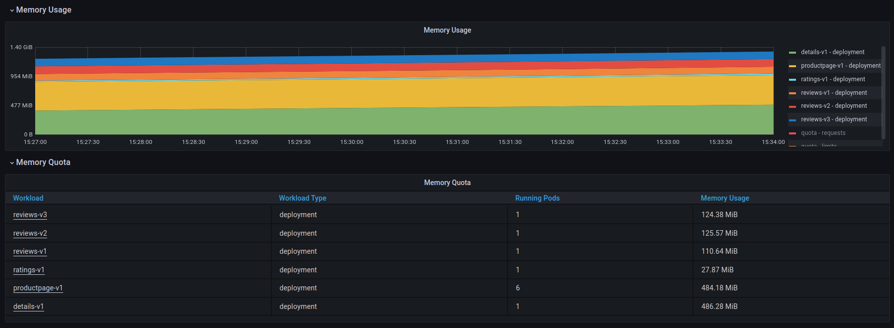
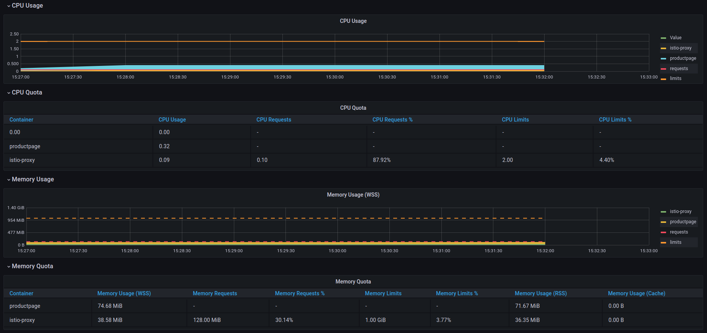
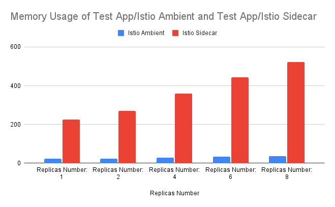
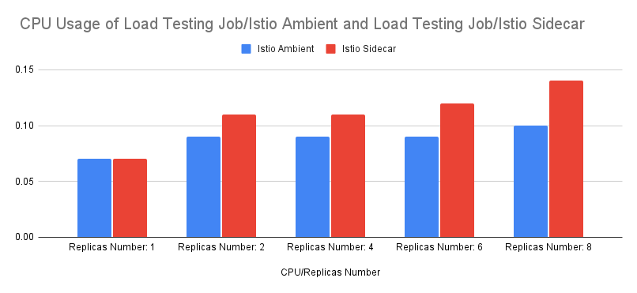

# Test Report - Istio Ambient vs Istio Sidecar

- [Test Report - Istio Ambient vs Istio Sidecar](#test-report---istio-ambient-vs-istio-sidecar)
  - [Overview](#overview)
  - [Comparative Study Continued](#comparative-study-continued)
    - [Environment Details](#environment-details)
    - [Network Tests](#network-tests)
    - [Performance Tests](#performance-tests)
    - [Operational Impact](#operational-impact)
    - [Compliance](#compliance)
  - [Resource Utilisation](#resource-utilisation)
    - [Environment Details](#environment-details-1)
    - [Testing Approach](#testing-approach)
    - [Results](#results)
  - [Conclusion](#conclusion)
  - [Acknowledgments](#acknowledgments)

## Overview

> ***Disclaimer:** Due to the dynamic nature of the Cloud environments we used in this comparison the absolute numerical results may vary, but relative percentages should remain relevant.*

This test report continues the initial [Service Mesh Test Report](./test-report.md) and extends our comparative analysis of service mesh technologies. It introduces Istio Ambient to the comparison and evaluates its performance relative to Istio Sidecar.

This document has 2 main sections:

- [Comparative Study Continued](#comparative-study-continued) — In this section we continue our initial study, preserving and reproducing all conditions to compare Istio Ambient vs Istio Sidecar.
- [Resource Utilisation](#resource-utilisation) — In this section we employ an alternative testing methodology to compare the resource utilisation of Istio Ambient vs Istio Sidecar, thus providing additional insights beyond those in our initial Service Mesh comparison.

 

- Contributor(s): Oleksandr
- Date Created: 28/05/2024
- Status: Approved
- Version: 1.0

## Comparative Study Continued

This document's first section incorporates Istio Ambient into our initial study, preserving the test approach, environment, and all other components. This enables the direct comparison of Istio Ambient with the other meshes analysed previously.

### Environment Details

If you require further details regarding our Environment Details, please refer to our initial [Service Mesh Test Report](./test-report.md#environment-details). During this comparison three environments were provisioned:

- **Baseline**: without any service mesh installed
- **Istio Ambient**: with Istio Ambient `v1.22.0` installed
- **Istio Sidecar**: with Istio Sidecar `v1.22.0` installed

### Network Tests

This section presents a comparison of network test results. If you require further details regarding our Test Approach, please refer to our initial [Service Mesh Test Report](./test-report.md#network-tests)

All raw network test results are stored in [network tests/v4/oha-results](../network-tests/oha-results) folder. As part of this section, they will be compared to define the pros and cons of each product.

The results are compared using the tables below. To easily understand them, please review the meaning of each column:

- Service mesh - Name of the product
- Time - Time that was needed to perform X number of requests
- QPS - Queries per Second or Requests per Second
- Response time percentiles - Time in which X% of the requests to the server will return a response

Additionally, at the top of each table, you can see the parameters of `oha` command.

To cover internal and external traffic tests were performed against different endpoints:

- Service IP - **Pod to Service communication** section
- Ingress IP - **VM to Ingress communication** section

**Pod to Service communication**

The results of network tests for Pod to Service communication are shown below, where the Pod is a Pod that runs load testing script, and the Service is a Service Endpoint of the `productpage` deployment.

**oha Configuration:** `Concurrent connections=32, Number of Requests = 300000`

| Service mesh  | Time           | QPS      | Response time percentiles (50%) | Response time percentiles (90%) | Response time percentiles (99%) | Response time percentiles (99.9%) |
|---------------|----------------|----------|---------------------------------|---------------------------------|---------------------------------|-----------------------------------|
| Baseline      | 2085.7161 secs | 143.8355 | 50.00% in 0.2197 secs           | 90.00% in 0.2721 secs           | 99.00% in 0.3289 secs           | 99.90% in 0.3871 secs             |
| Istio Ambient | 2295.2234 secs | 130.7062 | 50.00% in 0.2437 secs           | 90.00% in 0.2971 secs           | 99.00% in 0.3539 secs           | 99.90% in 0.4036 secs             |
| Istio Sidecar | 2408.9405 secs | 124.5361 | 50.00% in 0.2548 secs           | 90.00% in 0.3137 secs           | 99.00% in 0.3740 secs           | 99.90% in 0.4260 secs             |

**oha Configuration:** `Concurrent connections=64, Number of Requests = 300000`

| Service mesh  | Time           | QPS      | Response time percentiles (50%) | Response time percentiles (90%) | Response time percentiles (99%) | Response time percentiles (99.9%) |
|---------------|----------------|----------|---------------------------------|---------------------------------|---------------------------------|-----------------------------------|
| Baseline      | 1824.6383 secs | 164.4161 | 50.00% in 0.3836 secs           | 90.00% in 0.4589 secs           | 99.00% in 0.5798 secs           | 99.90% in 0.7084 secs             |
| Istio Ambient | 2345.4842 secs | 127.9054 | 50.00% in 0.4990 secs           | 90.00% in 0.5865 secs           | 99.00% in 0.6940 secs           | 99.90% in 0.7883 secs             |
| Istio Sidecar | 2431.2871 secs | 123.3914 | 50.00% in 0.5145 secs           | 90.00% in 0.6312 secs           | 99.00% in 0.7527 secs           | 99.90% in 0.8573 secs             |

**oha Configuration:** `Concurrent connections=128, Number of Requests = 300000`

| Service mesh  | Time           | QPS      | Response time percentiles (50%) | Response time percentiles (90%) | Response time percentiles (99%) | Response time percentiles (99.9%) |
|---------------|----------------|----------|---------------------------------|---------------------------------|---------------------------------|-----------------------------------|
| Baseline      | 1933.7084 secs | 155.1423 | 50.00% in 0.8022 secs           | 90.00% in 0.9898 secs           | 99.00% in 1.2044 secs           | 99.90% in 1.3984 secs             |
| Istio Ambient | 2380.6647 secs | 126.0152 | 50.00% in 1.0122 secs           | 90.00% in 1.1629 secs           | 99.00% in 1.3512 secs           | 99.90% in 1.5226 secs             |
| Istio Sidecar | 2458.1326 secs | 122.0439 | 50.00% in 1.0411 secs           | 90.00% in 1.2653 secs           | 99.00% in 1.5127 secs           | 99.90% in 1.7352 secs             |

From the tables above we can say that:

- on 32 connections Istio Ambient is faster than Istio Sidecar and provides higher QPS and lower response time on all percentiles.
- on 64 connections Istio Ambient is faster than Istio Sidecar and provides higher QPS and lower response time on all percentiles.
- on 128 connections Istio Ambient is faster than Istio Sidecar and provides higher QPS and lower response time on all percentiles.

**VM to Ingress communication**

The results of the VM to Ingress communication are shown below, where VM is a separate VM in the same region as the cluster worker nodes that runs load testing script, and Ingress is an Ingress Endpoint that exposes the Service of the `productpage` deployment.

**oha Configuration:** `Concurrent connections=32, Number of Requests = 300000`

| Service mesh  | Time           | QPS      | Response time percentiles (50%) | Response time percentiles (90%) | Response time percentiles (99%) | Response time percentiles (99.9%) |
|---------------|----------------|----------|---------------------------------|---------------------------------|---------------------------------|-----------------------------------|
| Baseline      | 1892.6016 secs | 158.5120 | 50.00% in 0.1998 secs           | 90.00% in 0.2408 secs           | 99.00% in 0.2902 secs           | 99.90% in 0.3397 secs             |
| Istio Ambient | 2373.0199 secs | 126.4212 | 50.00% in 0.2519 secs           | 90.00% in 0.3046 secs           | 99.00% in 0.3613 secs           | 99.90% in 0.4074 secs             |
| Istio Sidecar | 2455.7566 secs | 122.1619 | 50.00% in 0.2599 secs           | 90.00% in 0.3178 secs           | 99.00% in 0.3773 secs           | 99.90% in 0.4366 secs             |

**oha Configuration:** `Concurrent connections=64, Number of Requests = 300000`

| Service mesh  | Time           | QPS      | Response time percentiles (50%) | Response time percentiles (90%) | Response time percentiles (99%) | Response time percentiles (99.9%) |
|---------------|----------------|----------|---------------------------------|---------------------------------|---------------------------------|-----------------------------------|
| Baseline      | 1903.8515 secs | 157.5753 | 50.00% in 0.4021 secs           | 90.00% in 0.4785 secs           | 99.00% in 0.5827 secs           | 99.90% in 0.6851 secs             |
| Istio Ambient | 2423.0802 secs | 123.8094 | 50.00% in 0.5153 secs           | 90.00% in 0.6000 secs           | 99.00% in 0.7063 secs           | 99.90% in 0.8050 secs             |
| Istio Sidecar | 2500.5941 secs | 119.9715 | 50.00% in 0.5287 secs           | 90.00% in 0.6469 secs           | 99.00% in 0.7706 secs           | 99.90% in 0.8805 secs             |

**oha Configuration:** `Concurrent connections=128, Number of Requests = 300000`

| Service mesh  | Time           | QPS      | Response time percentiles (50%) | Response time percentiles (90%) | Response time percentiles (99%) | Response time percentiles (99.9%) |
|---------------|----------------|----------|---------------------------------|---------------------------------|---------------------------------|-----------------------------------|
| Baseline      | 1909.9278 secs | 157.0740 | 50.00% in 0.8097 secs           | 90.00% in 0.9576 secs           | 99.00% in 1.1305 secs           | 99.90% in 1.3028 secs             |
| Istio Ambient | 2462.3441 secs | 121.8351 | 50.00% in 1.0463 secs           | 90.00% in 1.2012 secs           | 99.00% in 1.3943 secs           | 99.90% in 1.5676 secs             |
| Istio Sidecar | 2534.2888 secs | 118.3764 | 50.00% in 1.0732 secs           | 90.00% in 1.3006 secs           | 99.00% in 1.5520 secs           | 99.90% in 1.7844 secs             |

From the tables above we can say that:

- on 32 connections Istio Ambient is faster than Istio Sidecar and provides higher QPS and lower response time on all percentiles.
- on 64 connections Istio Ambient is faster than Istio Sidecar and provides higher QPS and lower response time on all percentiles.
- on 128 connections Istio Ambient is faster than Istio Sidecar and provides higher QPS and lower response time on all percentiles.

**Network Tests Summary**

To summarise, the results in [Pod to Service communication](#pod-to-service-communication) and [VM to Ingress communication](#vm-to-ingress-communication) sections are similar and the difference between the products is visible.

Istio Ambient is faster than Istio Sidecar in all the tested cases. Istio Ambient also provides higher QPS and lower response time on all percentiles in all the tested cases.

### Performance Tests

This section presents a comparison of the resource overhead of all products during network tests. You can find all resource usage diagrams in [network tests/v4/diagrams](../network-tests/README.md) folder.

Resource usage was captured during network tests, so there will be references to Network Test results, to show the difference in performance.

As for Network Tests, there will be 2 subsections:

- [Pod to Service communication](#pod-to-service-communication-1)
- [VM to Ingress communication](#vm-to-ingress-communication-1)

Additionally, the Pod to Service communication section shows the resource usage of the job responsible for load testing, whilst the VM to Ingress communication section shows the resource usage of controllers responsible for ingress traffic.

The results are compared using the diagrams inside the tables. To easily understand them, please review the list of the tables:

- App Resource Usage - shows CPU and Memory usage of the `bookinfo` app components.
- Service Mesh Components Resource Usage - shows CPU and Memory usage of the service mesh components responsible for service-to-service communication (e.g sidecar, `ztunnel` DaemonSet).
- Job Resource Usage - shows CPU and Memory usage of the job responsible for load testing.
- Ingress Controller Resource Usage - shows CPU and Memory usage of controllers responsible for ingress traffic.

***Note**: Istio Discovery Service resource overhead isn't included in these tables because it is similar for all environments and loads, but diagrams that captured its resource usage are available in [network tests/v4/diagrams](../network-tests/README.md) folder.*

**Pod to Service communication**

App Resource Usage

 

**App CPU Usage**

| Service Mesh  | App CPU Usage                                                     |
|---------------|-------------------------------------------------------------------|
| Baseline      |       |
| Istio Ambient |  |
| Istio Sidecar |  |

**App Memory Usage**

| Service Mesh  | App Memory Usage                                                     |
|---------------|----------------------------------------------------------------------|
| Baseline      |       |
| Istio Ambient |  |
| Istio Sidecar |  |

Job Resource Usage

 

**Job CPU Usage**

| Service Mesh  | Job CPU Usage                                                                                                                                       |
|---------------|-----------------------------------------------------------------------------------------------------------------------------------------------------|
| Baseline      | N/A - Load Testing Job CPU usage in this cluster when performing the Baseline tests was comparable to the Istio Sidecar and Istio Ambient clusters. |
| Istio Ambient |                                                                       |
| Istio Sidecar |                                                                       |

**Job Memory Usage**

| Service Mesh  | Job Memory Usage                                                                                                                                    |
|---------------|-----------------------------------------------------------------------------------------------------------------------------------------------------|
| Baseline      | N/A - Load Testing Job CPU usage in this cluster when performing the Baseline tests was comparable to the Istio Sidecar and Istio Ambient clusters. |
| Istio Ambient |                                                                    |
| Istio Sidecar |                                                                    |

Service Mesh Components Resource Usage

 

**Service Mesh Components CPU Usage**

| Service Mesh Components              | Istio Ambient                                                                        | Istio Sidecar                                                             |
|--------------------------------------|--------------------------------------------------------------------------------------|---------------------------------------------------------------------------|
| Ambient DaemonSets                   |                | N/A                                                                       |
| ztunnel pod on Test Application node |   | N/A                                                                       |
| ztunnel pod on Load Testing node     |  | N/A                                                                       |
| Details pod                          | N/A                                                                                  |      |
| Ratings pod                          | N/A                                                                                  |      |
| Reviews v1 pod                       | N/A                                                                                  |    |
| Reviews v2 pod                       | N/A                                                                                  |    |
| Reviews v3 pod                       | N/A                                                                                  |    |
| Productpage pod                      | N/A                                                                                  |  |

**Service Mesh Components Memory Usage**

| Service Mesh Components              | Istio Ambient                                                                           | Istio Sidecar                                                                |
|--------------------------------------|-----------------------------------------------------------------------------------------|------------------------------------------------------------------------------|
| Ambient DaemonSets                   |                | N/A                                                                          |
| ztunnel pod on Test Application node |   | N/A                                                                          |
| ztunnel pod on Load Testing node     |  | N/A                                                                          |
| Details pod                          | N/A                                                                                     |      |
| Ratings pod                          | N/A                                                                                     |      |
| Reviews v1 pod                       | N/A                                                                                     |    |
| Reviews v2 pod                       | N/A                                                                                     |    |
| Reviews v3 pod                       | N/A                                                                                     |    |
| Productpage pod                      | N/A                                                                                     |  |

**VM to Ingress communication**

App Resource Usage

 

**App CPU Usage**

| Service Mesh  | App CPU Usage                                                    |
|---------------|------------------------------------------------------------------|
| Baseline      |       |
| Istio Ambient |  |
| Istio Sidecar |  |

**App Memory Usage**

| Service Mesh  | App Memory Usage                                                    |
|---------------|---------------------------------------------------------------------|
| Baseline      |       |
| Istio Ambient |  |
| Istio Sidecar |  |

Service Mesh Components Resource Usage

 

**Service Mesh Components CPU Usage**

| Service Mesh Components              | Istio Ambient                                                                       | Istio Sidecar                                                            |
|--------------------------------------|-------------------------------------------------------------------------------------|--------------------------------------------------------------------------|
| Ambient DaemonSets                   |                | N/A                                                                      |
| ztunnel pod on Test Application node |   | N/A                                                                      |
| ztunnel pod on Load Testing node     |  | N/A                                                                      |
| Details pod                          | N/A                                                                                 |      |
| Ratings pod                          | N/A                                                                                 |      |
| Reviews v1 pod                       | N/A                                                                                 |    |
| Reviews v2 pod                       | N/A                                                                                 |    |
| Reviews v3 pod                       | N/A                                                                                 |    |
| Productpage pod                      | N/A                                                                                 |  |

**Service Mesh Components Memory Usage**

| Service Mesh Components              | Istio Ambient                                                                          | Istio Sidecar                                                               |
|--------------------------------------|----------------------------------------------------------------------------------------|-----------------------------------------------------------------------------|
| Ambient DaemonSets                   |                | N/A                                                                         |
| ztunnel pod on Test Application node |   | N/A                                                                         |
| ztunnel pod on Load Testing node     |  | N/A                                                                         |
| Details pod                          | N/A                                                                                    |      |
| Ratings pod                          | N/A                                                                                    |      |
| Reviews v1 pod                       | N/A                                                                                    |    |
| Reviews v2 pod                       | N/A                                                                                    |    |
| Reviews v3 pod                       | N/A                                                                                    |    |
| Productpage pod                      | N/A                                                                                    |  |

Ingress Controller Resource Usage

 

**Ingress Controller CPU Usage**

| Service Mesh  | Ingress Controller CPU Usage                                         |
|---------------|----------------------------------------------------------------------|
| Baseline      |       |
| Istio Ambient |  |
| Istio Sidecar |  |

**Ingress Controller Memory Usage**

| Service Mesh  | Ingress Controller Memory Usage                                         |
|---------------|-------------------------------------------------------------------------|
| Baseline      |       |
| Istio Ambient |  |
| Istio Sidecar |  |

**Performance Tests Summary**

Based on the tables above, we can conclude that Istio Ambient consumes fewer resources and performs better than Istio Sidecar for all communications. Istio Ambient consistently uses less memory. However, the difference in CPU usage depends on the number of pods managed by the `ztunnel` DaemonSet. For instance, in our load testing job with one pod, the CPU usage remains the same for both Istio Ambient and Istio Sidecar. But for the `bookinfo` app, the CPU usage differs by approximately 25%.

In terms of ingress traffic, both Istio Ambient and Istio Sidecar environments utilise the same Istio Ingress Controller, so any difference in resource overhead should be attributed to variations in performance of the mesh.

### Operational Impact

The Operational Impact section outlines the efforts and potential impact of implementing each product. It provides information about the following areas:

- Prerequisites
- Product Integration
- Product Usability
- Support Contracts
- Upgrade cycle

**Istio Sidecar**

For details of the operational impact for Istio Sidecar, please follow [the link to our previous study](./test-report.md#istio).

**Istio Ambient**

**Prerequisites**

- [Istio Ambient Prerequisites document](https://istio.io/latest/docs/ambient/install/platform-prerequisites/)

For more information on the prerequisites and maintenance of the Istio Ambient, please refer to the Istio Ambient section in the [Operational Manual Update document](operational-manual.md).

**Product Integration**

To use Istio, you will need to install four helm charts. If you require an ingress controller, you can also install one more. Istio offers support for various ingress resources such as Ingress, Gateway API, and Istio Gateway, which simplifies the process of implementing a service mesh. To summarise, you need to install five Helm charts to introduce Istio to your cluster. After that, you can start meshing your services.

**Product Usability**

To use Istio Ambient, you just need to label namespaces or pods, and your service-to-service communications will be meshed. Next, you should configure ingress resources to mesh ingress traffic. Finally, you can set up policies and rules using different Istio CRs.

**Support Contracts**

Istio has a lot of 3rd party providers that can provide you with enterprise support and enterprise distribution of Istio. The most popular are [Tetrate](https://tetrate.io/tetrate-istio-subscription), [Solo.io](https://www.solo.io/istio-support).

**Upgrade Cycle**

It's important to know how often you need to upgrade your software, so below you can see the approximate interval of the releases.

- Minor release ~ once every few months
- Minor release support ~ 6 months
- Patch release ~ once a month

***Note:** There is no accurate schedule, so all assumptions are based on previous releases. Istio Ambient is currently in beta status, so the release schedule may vary.*

**Summary**

If you require a service mesh solution, Istio Ambient is a reliable option. It has all benefits of Istio Sidecar and additionally provides you with better performance and lower resource usage. However, it's worth noting that Istio Ambient, in comparison to Istio Sidecar, requires the installation of 2 additional helm charts, which will impact your operations during upgrades.

### Compliance

This section contains information on compliance and standards that your business may need to adhere to. The most widely used standard for service meshes is FIPS (140-2, 140-3), which outlines the security requirements a cryptographic module must meet. Both Istio products tested have FIPS-compliant versions, but the methods for achieving FIPS certification/validation vary.

**Istio Sidecar**

For details of the operational impact for Istio Sidecar, please follow [the link to our previous study](./test-report.md#istio-1).

**Istio Ambient**

Istio Ambient uses FIPS certified crypto modules. To achieve FIPS certification you may need to acquire support from 3rd party providers (refer to the [Support Contracts section](#istio-ambient) to get well-known Istio providers).

## Resource Utilisation

We expanded our study to include an additional series of tests for comparing Resource Utilisation. Given the nature of the two Istio products', we were interested to see how CPU and Memory usage differs as we scale the number of replicas.

### Environment Details

If you require further details regarding our Environment Details, please refer to our [initial Service Mesh Test Report](./test-report.md#environment-details). During this comparison, two environments were provisioned:

- **Istio Ambient**: with Istio Ambient v1.22.0 installed
- **Istio Sidecar**: with Istio Sidecar v1.22.0 installed

To provide higher number of replicas, we changed the node type from `c5.large` to `c5.xlarge`.

### Testing Approach

We used the testing approach from our initial study as a base, but with some small changes. We decided to run multiple retries and increase the number of product page deployment replicas with each retry. This allowed us to observe the difference in resource usage of Istio Ambient and Istio Sidecar at scale.

In summary, we conducted five sets of tests across two environments with `1`, `2`, `4`, `6`, and `8` replicas respectively. Each set of tests included three tests with `32`, `64`, and `128` concurrent connections and `30000` requests.

### Results

This section presents a comparison of the resource overhead of Istio Sidecar and Istio Ambient during network tests. You can find all resource usage diagrams in [network tests/v6/diagrams](../network-tests/README.md) folder.

We have split the the results into the following three subsections:
- Pod to Service Resource Usage
- Test App Resource Usage
- Load Testing Resource Usage

**Pod to Service communication**

The results are compared using the diagrams inside the tables and split by number of replicas. To easily understand them, please review the list of the tables:

- App Resource Usage - shows CPU and Memory usage of the `bookinfo` app components.
- Service Mesh Components Resource Usage - shows CPU and Memory usage of the service mesh components responsible for service-to-service communication (e.g sidecar, `ztunnel` DaemonSet).
- Job Resource Usage - shows CPU and Memory usage of the job responsible for load testing.

Replica Number: 1

 

**App Resource Usage**

| Service Mesh  | App Resource Usage                                                                                                                                 |
|---------------|----------------------------------------------------------------------------------------------------------------------------------------------------|
| Istio Ambient |   |
| Istio Sidecar |   |

**Job Resource Usage**

| Service Mesh  | Job CPU Usage                                                                                                                                      |
|---------------|----------------------------------------------------------------------------------------------------------------------------------------------------|
| Istio Ambient |   |
| Istio Sidecar |                                                                                 |

**Service Mesh Components Resource Usage**

| Service Mesh Components              | Istio Ambient                                                                                                                                                                                                                            | Istio Sidecar                                                             |
|--------------------------------------|------------------------------------------------------------------------------------------------------------------------------------------------------------------------------------------------------------------------------------------|---------------------------------------------------------------------------|
| Ambient DaemonSets                   |                       | N/A                                                                       |
| ztunnel pod on Test Application node |     | N/A                                                                       |
| ztunnel pod on Load Testing node     |   | N/A                                                                       |
| Details pod                          | N/A                                                                                                                                                                                                                                      |    |
| Ratings pod                          | N/A                                                                                                                                                                                                                                      |    |
| Reviews v1 pod                       | N/A                                                                                                                                                                                                                                      |  |
| Reviews v2 pod                       | N/A                                                                                                                                                                                                                                      |  |
| Reviews v3 pod                       | N/A                                                                                                                                                                                                                                      |  |
| Productpage pod                      | N/A                                                                                                                                                                                                                                      |         |

Replica Number: 2

 

**App Resource Usage**

| Service Mesh  | App Resource Usage                                                                                                                                 |
|---------------|----------------------------------------------------------------------------------------------------------------------------------------------------|
| Istio Ambient |   |
| Istio Sidecar |   |

**Job Resource Usage**

| Service Mesh  | Job CPU Usage                                                                                                                                      |
|---------------|----------------------------------------------------------------------------------------------------------------------------------------------------|
| Istio Ambient |   |
| Istio Sidecar |                                                                                 |

**Service Mesh Components Resource Usage**

| Service Mesh Components              | Istio Ambient                                                                                                                                                                                                                            | Istio Sidecar                                                             |
|--------------------------------------|------------------------------------------------------------------------------------------------------------------------------------------------------------------------------------------------------------------------------------------|---------------------------------------------------------------------------|
| Ambient DaemonSets                   |                       | N/A                                                                       |
| ztunnel pod on Test Application node |     | N/A                                                                       |
| ztunnel pod on Load Testing node     |   | N/A                                                                       |
| Details pod                          | N/A                                                                                                                                                                                                                                      |    |
| Ratings pod                          | N/A                                                                                                                                                                                                                                      |    |
| Reviews v1 pod                       | N/A                                                                                                                                                                                                                                      |  |
| Reviews v2 pod                       | N/A                                                                                                                                                                                                                                      |  |
| Reviews v3 pod                       | N/A                                                                                                                                                                                                                                      |  |
| Productpage-1 pod                    | N/A                                                                                                                                                                                                                                      |       |
| Productpage-2 pod                    | N/A                                                                                                                                                                                                                                      |       |

Replica Number: 4

 

**App Resource Usage**

| Service Mesh  | App Resource Usage                                                                                                                                 |
|---------------|----------------------------------------------------------------------------------------------------------------------------------------------------|
| Istio Ambient |   |
| Istio Sidecar |   |

**Job Resource Usage**

| Service Mesh  | Job CPU Usage                                                                                                                                      |
|---------------|----------------------------------------------------------------------------------------------------------------------------------------------------|
| Istio Ambient |   |
| Istio Sidecar |                                                                                 |

**Service Mesh Components Resource Usage**

| Service Mesh Components              | Istio Ambient                                                                                                                                                                                                                            | Istio Sidecar                                                             |
|--------------------------------------|------------------------------------------------------------------------------------------------------------------------------------------------------------------------------------------------------------------------------------------|---------------------------------------------------------------------------|
| Ambient DaemonSets                   |                       | N/A                                                                       |
| ztunnel pod on Test Application node |     | N/A                                                                       |
| ztunnel pod on Load Testing node     |   | N/A                                                                       |
| Details pod                          | N/A                                                                                                                                                                                                                                      |    |
| Ratings pod                          | N/A                                                                                                                                                                                                                                      |    |
| Reviews v1 pod                       | N/A                                                                                                                                                                                                                                      |  |
| Reviews v2 pod                       | N/A                                                                                                                                                                                                                                      |  |
| Reviews v3 pod                       | N/A                                                                                                                                                                                                                                      |  |
| Productpage-1 pod                    | N/A                                                                                                                                                                                                                                      |       |
| Productpage-2 pod                    | N/A                                                                                                                                                                                                                                      |       |
| Productpage-3 pod                    | N/A                                                                                                                                                                                                                                      |       |
| Productpage-4 pod                    | N/A                                                                                                                                                                                                                                      |       |

Replica Number: 6

 

**App Resource Usage**

| Service Mesh  | App Resource Usage                                                                                                                                 |
|---------------|----------------------------------------------------------------------------------------------------------------------------------------------------|
| Istio Ambient |   |
| Istio Sidecar |   |

**Job Resource Usage**

| Service Mesh  | Job CPU Usage                                                                                                                                      |
|---------------|----------------------------------------------------------------------------------------------------------------------------------------------------|
| Istio Ambient |   |
| Istio Sidecar |                                                                                 |

**Service Mesh Components Resource Usage**

| Service Mesh Components              | Istio Ambient                                                                                                                                                                                                                            | Istio Sidecar                                                             |
|--------------------------------------|------------------------------------------------------------------------------------------------------------------------------------------------------------------------------------------------------------------------------------------|---------------------------------------------------------------------------|
| Ambient DaemonSets                   |                       | N/A                                                                       |
| ztunnel pod on Test Application node |     | N/A                                                                       |
| ztunnel pod on Load Testing node     |   | N/A                                                                       |
| Details pod                          | N/A                                                                                                                                                                                                                                      |    |
| Ratings pod                          | N/A                                                                                                                                                                                                                                      |    |
| Reviews v1 pod                       | N/A                                                                                                                                                                                                                                      |  |
| Reviews v2 pod                       | N/A                                                                                                                                                                                                                                      |  |
| Reviews v3 pod                       | N/A                                                                                                                                                                                                                                      |  |
| Productpage-1 pod                    | N/A                                                                                                                                                                                                                                      |       |
| Productpage-2 pod                    | N/A                                                                                                                                                                                                                                      |       |
| Productpage-3 pod                    | N/A                                                                                                                                                                                                                                      |       |
| Productpage-4 pod                    | N/A                                                                                                                                                                                                                                      |       |
| Productpage-5 pod                    | N/A                                                                                                                                                                                                                                      |       |
| Productpage-6 pod                    | N/A                                                                                                                                                                                                                                      |       |

Replica Number: 8

 

**App Resource Usage**

| Service Mesh  | App Resource Usage                                                                                                                                 |
|---------------|----------------------------------------------------------------------------------------------------------------------------------------------------|
| Istio Ambient |   |
| Istio Sidecar |   |

**Job Resource Usage**

| Service Mesh  | Job CPU Usage                                                                                                                                      |
|---------------|----------------------------------------------------------------------------------------------------------------------------------------------------|
| Istio Ambient |   |
| Istio Sidecar |                                                                                 |

**Service Mesh Components Resource Usage**

| Service Mesh Components              | Istio Ambient                                                                                                                                                                                                                            | Istio Sidecar                                                             |
|--------------------------------------|------------------------------------------------------------------------------------------------------------------------------------------------------------------------------------------------------------------------------------------|---------------------------------------------------------------------------|
| Ambient DaemonSets                   |                       | N/A                                                                       |
| ztunnel pod on Test Application node |     | N/A                                                                       |
| ztunnel pod on Load Testing node     |   | N/A                                                                       |
| Details pod                          | N/A                                                                                                                                                                                                                                      |    |
| Ratings pod                          | N/A                                                                                                                                                                                                                                      |    |
| Reviews v1 pod                       | N/A                                                                                                                                                                                                                                      |  |
| Reviews v2 pod                       | N/A                                                                                                                                                                                                                                      |  |
| Reviews v3 pod                       | N/A                                                                                                                                                                                                                                      |  |
| Productpage-1 pod                    | N/A                                                                                                                                                                                                                                      |       |
| Productpage-2 pod                    | N/A                                                                                                                                                                                                                                      |       |
| Productpage-3 pod                    | N/A                                                                                                                                                                                                                                      |       |
| Productpage-4 pod                    | N/A                                                                                                                                                                                                                                      |       |
| Productpage-5 pod                    | N/A                                                                                                                                                                                                                                      |       |
| Productpage-6 pod                    | N/A                                                                                                                                                                                                                                      |       |
| Productpage-7 pod                    | N/A                                                                                                                                                                                                                                      |       |
| Productpage-8 pod                    | N/A                                                                                                                                                                                                                                      |       |

**Test App and Load testing Job resource usage**

The data below includes only resource usage of the `ztunnel` DaemonSet pod on a specific node for Istio Ambient and a sum of all sidecars of a workload for Istio Sidecar.

Test App Resource Usage

 

**Test App CPU Usage**

| Replicas Number    | Istio Ambient | Istio Sidecar |
|--------------------|---------------|---------------|
| Replicas Number: 1 | 0.4           | 0.53          |
| Replicas Number: 2 | 0.55          | 0.78          |
| Replicas Number: 4 | 0.59          | 0.93          |
| Replicas Number: 6 | 0.6           | 0.95          |
| Replicas Number: 8 | 0.6           | 0.96          |

**Test App Memory Usage**

| Replicas Number    | Istio Ambient | Istio Sidecar |
|--------------------|---------------|---------------|
| Replicas Number: 1 | 22.88 MiB     | 226.43 MiB    |
| Replicas Number: 2 | 23.25 MiB     | 269.8 MiB     |
| Replicas Number: 4 | 29.17 MiB     | 358.31 MiB    |
| Replicas Number: 6 | 33.05 MiB     | 442.18 MiB    |
| Replicas Number: 8 | 34.83 MiB     | 521.1 MiB     |

Load Testing Job Resource Usage

 

**Load Testing Job CPU Usage**

| Replicas Number    | Istio Ambient | Istio Sidecar |
|--------------------|---------------|---------------|
| Replicas Number: 1 | 0.07          | 0.07          |
| Replicas Number: 2 | 0.09          | 0.11          |
| Replicas Number: 4 | 0.09          | 0.11          |
| Replicas Number: 6 | 0.09          | 0.12          |
| Replicas Number: 8 | 0.1           | 0.14          |

**Load Testing Job Memory Usage**

| Replicas Number    | Istio Ambient | Istio Sidecar |
|--------------------|---------------|---------------|
| Replicas Number: 1 | 12.14 MiB     | 48.49 MiB     |
| Replicas Number: 2 | 15.85 MiB     | 49.02 MiB     |
| Replicas Number: 4 | 16.08 MiB     | 49.93 MiB     |
| Replicas Number: 6 | 19.41 MiB     | 51.16 MiB     |
| Replicas Number: 8 | 19.08 MiB     | 50.41 MiB     |

**Summary**

Based on the tables above, we can conclude that Istio Ambient consumes less resources than Istio Sidecar at all scales.

For the `bookinfo` app with `1` replica, the difference in CPU and memory usage is approximately `28%` and `160%` respectively. However, for the `bookinfo` app with `8` replicas, the difference in CPU and memory usage is about `46%` and `175%` respectively.

## Conclusion

For a single pod, Istio Ambient consumes nearly the same amount of CPU but almost four times less memory compared to Istio Sidecar. As the number of pods increases, the difference in resource utilisation becomes more significant, as illustrated in the graphs below:

|  |  |
| ----------------------- | -------------------------- |

In summary, Istio Ambient is a great product, which is definitely faster and more performative than Istio Sidecar.
Leveraging the strengths of Istio Sidecar, Istio Ambient effectively addresses performance and resource overhead issues and becomes a strong contender to all products from our service mesh comparison. However, it introduces operational complexity by using 2 additional helm charts and currently being in beta status, potentially impacting the upgrade cycle of your teams.

Going back to the original purpose of this summary, we are unable to recommend a specific product, but we can provide an updated table of requirements, that may help you choose the right mesh.

| Primary Requirement                 | Suggested Mesh                                                 |
|-------------------------------------|----------------------------------------------------------------|
| Performance                         | No Mesh or Linkerd                                             |
| Ease of Installation                | Cilium (if using Cilium CNI) or Istio Sidecar or Istio Ambient |
| Ease of Maintenance                 | Cilium (if using Cilium CNI) or Istio Sidecar                  |
| Compliance                          | All meshes have FIPS-compliant builds                          |
| Reduced Cost & Resource Utilisation | Cilium or Linkerd or Istio Ambient                             |
| Available support contracts         | All meshes have available support contracts                    |

## Acknowledgments

Thank you to [Lin Sun](https://github.com/linsun), who reached out via [Issue #2](https://github.com/livewyer-ops/poc-servicemesh2024/issues/2) and requested the addition of Istio Ambient.
