# Test Report

- [Test Report](#test-report)
  - [Overview](#overview)
  - [Environment Details](#environment-details)
  - [Product Deployment Evidence](#product-deployment-evidence)
  - [Network Tests](#network-tests)
  - [Performance Tests](#performance-tests)
    - [Pod to Service communication](#pod-to-service-communication)
    - [VM to Ingress communication](#vm-to-ingress-communication)
  - [Operational Impact](#operational-impact)
    - [Cilium](#cilium)
    - [Istio](#istio)
    - [Linkerd](#linkerd)
  - [Iterate and Improve](#iterate-and-improve)
  - [Compliance](#compliance)
    - [Linkerd](#linkerd-1)
    - [Cilium](#cilium-1)
    - [Istio](#istio-1)
  - [Final Summary](#final-summary)

## Overview

This test report assesses three prominent service meshes **Istio**, **Linkerd**, and **Cilium** on critical factors such as ease of deployment, performance, cost and resource usage, operational overhead, support and compliance.

As different organisations have unique priorities, our analysis offers tailored insights into how each service mesh performs in various scenarios. LiveWyer's findings aim to help you make a well-informed decision about the best service mesh for your specific needs.

- Contributor(s): Oleksandr
- Date Created: 18/03/2024
- Status: Approved
- Version: 1.0

## Environment Details

All tests were performed in separate isolated environments. The environment is a Kubernetes cluster with a tested product installed, and therefore, the four environments provisioned were:

- Baseline
- Cilium
- Istio
- Linkerd

AWS EKS was used to run Kubernetes clusters with the following configuration:

- Region: us-east-1
- Location: US East (N. Virginia)
- Availability zone: us-east-1a
- Worker nodes: 4 worker nodes type [c5.large](https://aws.amazon.com/ec2/instance-types/c5) (2 vCPU, 4 GiB Memory)
- Node OS Image: Amazon Linux 2
- Kubernetes version: 1.28.7
- CNI: VPC CNI v1.16.3-eksbuild.2

All nodes were tainted, and respective tolerations were added to the apps, making scheduling predictable and immutable across all environments.

## Product Deployment Evidence

This section proves that all products were deployed and provides instructions on how to replicate the environment.

During this comparison all environments were created using LWDE and service meshes were installed using [initialize.sh](../templates/initialize.sh) bash script.

[initialize.sh](../templates/initialize.sh) bash script contains commands to initialise the AWS EKS cluster (e.g. provide access to the cluster, taint nodes) and install one of three service meshes. Service mesh installation commands were taken from the [Operational Manual](operational-manual.md) document and slightly modified to meet the requirements of our environments (tolerations) and ensure smooth script running.

All templates and scripts that were created as part of this comparison are stored in `templates` folder. There you can find:

- `clusters` subfolder where cluster helm releases are stored
- Istio and Cilium templates, which allow us to enforce needed policies and expose apps to the internet using Gateways
- Secret for External DNS credentials
- Selfsigned Issuer

To replicate one of the environments you need to:

- Deploy a cluster using one of the helm releases in [./templates/clusters](../templates/clusters) folder
- Update variables in [initialize.sh](../templates/initialize.sh) bash script and run it with the preferred argument

After creating the environment and installing the service mesh, you can apply additional templates as needed.

## Network Tests

This section outlines our testing approach and compares network test results.

All raw network test results are stored in [network tests/v3/oha-results](../network-tests/oha-results) folder. As part of this section, they will be compared to define the pros and cons of each product.

The results are compared using the tables below. To easily understand them, please review the meaning of each column:

- Service mesh - Name of the product
- Time - Time that was needed to perform X number of requests
- QPS - Queries per Second or Requests per Second
- Response time percentiles - Time in which X% of the requests to the server will return a response

Additionally, at the top of each table, you can see the parameters of `oha` command.

**Testing Approach**

Our testing approach involves load testing of test application that consist of multiple meshed microservices that communicate with each other.
As a test application, we use [Istio bookinfo](https://github.com/istio/istio/blob/master/samples/bookinfo/README.md) app that is wrapped into a [helm chart](../charts/bookinfo/Chart.yaml) and installed using Flux on all our environments.  
As a load-testing tool, we use [oha](https://github.com/hatoo/oha).
The following `oha` command was used to run the tests:  
`oha $URL -c $CONCURRENT_CONNECTIONS -n $REQUESTS --disable-keepalive --disable-compression --insecure --ipv4 --no-tui`, where `$URL` is a DNS name of the service, `$CONCURRENT_CONNECTIONS` is a number of concurrent connections, `$REQUESTS` is a number of requests to send.  
Tests were performed on different environments at the same time to minimise the network difference and get more accurate results.

To cover internal and external traffic tests were performed against different endpoints:

- Service IP - **Pod to Service communication** section
- Ingress IP - **VM to Ingress communication** section

**Pod to Service communication**

This section compares the results of network tests for Pod to Service communication, where Pod is a Pod, that runs load testing script and Service is a Service Endpoint of the `productpage` deployment. Below you can see the comparison tables:

**oha Configuration:** `Concurrent connections=32, Number of Requests = 300000`

| Service mesh | Time           | QPS      | Response time percentiles (50%) | Response time percentiles (90%) | Response time percentiles (99%) | Response time percentiles (99.9%) |
| ------------ | -------------- | -------- | ------------------------------- | ------------------------------- | ------------------------------- | --------------------------------- |
| Istio        | 2494.2895 secs | 120.2747 | 50.00% in 0.2641 secs           | 90.00% in 0.3267 secs           | 99.00% in 0.3872 secs           | 99.90% in 0.4350 secs             |
| Linkerd      | 2043.7062 secs | 146.7921 | 50.00% in 0.2164 secs           | 90.00% in 0.2565 secs           | 99.00% in 0.3059 secs           | 99.90% in 0.3548 secs             |
| Baseline     | 1905.4200 secs | 157.4456 | 50.00% in 0.2017 secs           | 90.00% in 0.2410 secs           | 99.00% in 0.2891 secs           | 99.90% in 0.3389 secs             |
| Cilium       | 2501.3887 secs | 119.9334 | 50.00% in 0.2646 secs           | 90.00% in 0.3210 secs           | 99.00% in 0.3843 secs           | 99.90% in 0.4500 secs             |

**oha Configuration:** `Concurrent connections=64, Number of Requests = 300000`

| Service mesh | Time           | QPS      | Response time percentiles (50%) | Response time percentiles (90%) | Response time percentiles (99%) | Response time percentiles (99.9%) |
| ------------ | -------------- | -------- | ------------------------------- | ------------------------------- | ------------------------------- | --------------------------------- |
| Istio        | 2499.9058 secs | 120.0045 | 50.00% in 0.5286 secs           | 90.00% in 0.6527 secs           | 99.00% in 0.7774 secs           | 99.90% in 0.8851 secs             |
| Linkerd      | 2072.4030 secs | 144.7595 | 50.00% in 0.4380 secs           | 90.00% in 0.5275 secs           | 99.00% in 0.6340 secs           | 99.90% in 0.7284 secs             |
| Baseline     | 1936.5763 secs | 154.9126 | 50.00% in 0.4101 secs           | 90.00% in 0.4865 secs           | 99.00% in 0.5850 secs           | 99.90% in 0.6756 secs             |
| Cilium       | 2538.3152 secs | 118.1886 | 50.00% in 0.5375 secs           | 90.00% in 0.6350 secs           | 99.00% in 0.7493 secs           | 99.90% in 0.8553 secs             |

**oha Configuration:** `Concurrent connections=128, Number of Requests = 300000`

| Service mesh | Time           | QPS      | Response time percentiles (50%) | Response time percentiles (90%) | Response time percentiles (99%) | Response time percentiles (99.9%) |
| ------------ | -------------- | -------- | ------------------------------- | ------------------------------- | ------------------------------- | --------------------------------- |
| Istio        | 2525.5519 secs | 118.7859 | 50.00% in 1.0696 secs           | 90.00% in 1.3039 secs           | 99.00% in 1.5577 secs           | 99.90% in 1.7781 secs             |
| Linkerd      | 2095.0241 secs | 143.1964 | 50.00% in 0.8865 secs           | 90.00% in 1.0655 secs           | 99.00% in 1.2693 secs           | 99.90% in 1.4569 secs             |
| Baseline     | 1962.8008 secs | 152.8428 | 50.00% in 0.8319 secs           | 90.00% in 0.9871 secs           | 99.00% in 1.1630 secs           | 99.90% in 1.3289 secs             |
| Cilium       | 2582.3604 secs | 116.1728 | 50.00% in 1.0934 secs           | 90.00% in 1.2869 secs           | 99.00% in 1.5055 secs           | 99.90% in 1.7041 secs             |

From the tables above we can say that:

- on 32 connections Linkerd is the fastest service mesh, Istio and Cilium are almost on the same level. Istio provides higher QPS while Cilium provides smaller latency on 90
  and 99 percentiles.
- on 64 connections Linkerd is the fastest service mesh, Istio and Cilium are almost on the same level. Istio provides higher QPS while Cilium provides smaller latency on 90,
  99 and 99.9 percentiles.
- on 128 connections Linkerd is the fastest service mesh, Istio and Cilium are almost on the same level. Istio provides higher QPS while Cilium provides smaller latency on 90,
  99 and 99.9 percentiles.

**VM to Ingress communication**

This section compares the results of network tests for VM to Ingress communication, where VM is a separate VM in the same region as the cluster worker nodes, that runs load testing script and Ingress is an Ingress Endpoint, that exposes the Service of the `productpage` deployment. Below you can see the comparison tables:

**oha Configuration:** `Concurrent connections=32, Number of Requests = 300000`

| Service mesh | Time           | QPS      | Response time percentiles (50%) | Response time percentiles (90%) | Response time percentiles (99%) | Response time percentiles (99.9%) |
| ------------ | -------------- | -------- | ------------------------------- | ------------------------------- | ------------------------------- | --------------------------------- |
| Istio        | 2516.1863 secs | 119.2281 | 50.00% in 0.2664 secs           | 90.00% in 0.3275 secs           | 99.00% in 0.3874 secs           | 99.90% in 0.4384 secs             |
| Linkerd      | 2098.4261 secs | 142.9643 | 50.00% in 0.2224 secs           | 90.00% in 0.2637 secs           | 99.00% in 0.3137 secs           | 99.90% in 0.3610 secs             |
| Baseline     | 1955.4436 secs | 153.4179 | 50.00% in 0.2070 secs           | 90.00% in 0.2463 secs           | 99.00% in 0.2934 secs           | 99.90% in 0.3418 secs             |
| Cilium       | 2696.0150 secs | 111.2753 | 50.00% in 0.2852 secs           | 90.00% in 0.3517 secs           | 99.00% in 0.4222 secs           | 99.90% in 0.4955 secs             |

**oha Configuration:** `Concurrent connections=64, Number of Requests = 300000`

| Service mesh | Time           | QPS      | Response time percentiles (50%) | Response time percentiles (90%) | Response time percentiles (99%) | Response time percentiles (99.9%) |
| ------------ | -------------- | -------- | ------------------------------- | ------------------------------- | ------------------------------- | --------------------------------- |
| Istio        | 2542.2097 secs | 118.0076 | 50.00% in 0.5380 secs           | 90.00% in 0.6622 secs           | 99.00% in 0.7892 secs           | 99.90% in 0.8978 secs             |
| Linkerd      | 2122.3329 secs | 141.3539 | 50.00% in 0.4489 secs           | 90.00% in 0.5391 secs           | 99.00% in 0.6461 secs           | 99.90% in 0.7407 secs             |
| Baseline     | 1985.5092 secs | 151.0947 | 50.00% in 0.4208 secs           | 90.00% in 0.4970 secs           | 99.00% in 0.5981 secs           | 99.90% in 0.6997 secs             |
| Cilium       | 2665.2630 secs | 112.5592 | 50.00% in 0.5674 secs           | 90.00% in 0.6891 secs           | 99.00% in 0.8134 secs           | 99.90% in 0.9235 secs             |

**oha Configuration:** `Concurrent connections=128, Number of Requests = 300000`

| Service mesh                        | Time           | QPS      | Response time percentiles (50%) | Response time percentiles (90%) | Response time percentiles (99%) | Response time percentiles (99.9%) |
| ----------------------------------- | -------------- | -------- | ------------------------------- | ------------------------------- | ------------------------------- | --------------------------------- |
| Istio                               | 2563.4213 secs | 117.0311 | 50.00% in 1.0867 secs           | 90.00% in 1.3224 secs           | 99.00% in 1.5763 secs           | 99.90% in 1.8081 secs             |
| Linkerd                             | 2154.8882 secs | 139.2184 | 50.00% in 0.9115 secs           | 90.00% in 1.0968 secs           | 99.00% in 1.3115 secs           | 99.90% in 1.5200 secs             |
| :eight_pointed_black_star: Baseline | 2230.1591 secs | 134.5196 | 50.00% in 0.8579 secs           | 90.00% in 1.0467 secs           | 99.00% in 3.0331 secs           | 99.90% in 3.1438 secs             |
| :eight_pointed_black_star: Cilium   | 2760.3969 secs | 108.6800 | 50.00% in 1.1709 secs           | 90.00% in 1.3808 secs           | 99.00% in 1.6157 secs           | 99.90% in 1.8216 secs             |

From the tables above we can say that:

- on 32 connections Linkerd is the fastest service mesh and Cilium is the slowest one.
- on 64 connections Linkerd is the fastest service mesh, Istio still performs better than Cilium, but the difference is smaller than on 32 connections.
- on 128 connections Linkerd is the fastest service mesh and Cilium is the slowest one.  
  :eight*pointed_black_star: \_Note: Tests for Cilium and Baseline have failed due to a memory leak in the Bookinfo app, that caused pod recreation, so they are outliers in this test. You can also see this on the [App CPU Usage diagrams](#app-cpu-usage-1). However reviewing the trend on 32 and 64 connections, I can say that without pod recreation, Istio and Cilium would have similar latency.*

**Summary**

To summarise, the results in [Pod to Service communication](#pod-to-service-communication) and [VM to Ingress communication](#vm-to-ingress-communication) sections are similar and the difference between the products is visible.

Linkerd is the fastest service mesh among the ones that have been tested. However, when comparing Istio and Cilium, it's difficult to say which one performs better. Istio provides higher QPS and lower latency on low connections, while Cilium shows better latency on higher connections.

## Performance Tests

This section presents a comparison of the resource overhead of all products during network tests. You can find all resource usage diagrams in [network tests/v3/diagrams](../network-tests/README.md) folder.

Resource usage was captured during network tests, so there will be references to Network Test results, to show the difference in performance.

As for Network Tests, there will be 2 subsections:

- [Pod to Service communication](#pod-to-service-communication-1)
- [VM to Ingress communication](#vm-to-ingress-communication-1)

VM to Ingress communication section additionally shows the resource usage of controllers responsible for ingress traffic.

The results are compared using the diagrams inside the tables. To easily understand them, please review the meaning of each column:

- Service mesh - Name of the product
- `<Component>` CPU Usage - Name of the CPU consumer

### Pod to Service communication

**App CPU Usage**

| Service Mesh | App CPU Usage                                                |
| ------------ | ------------------------------------------------------------ |
| Baseline     | 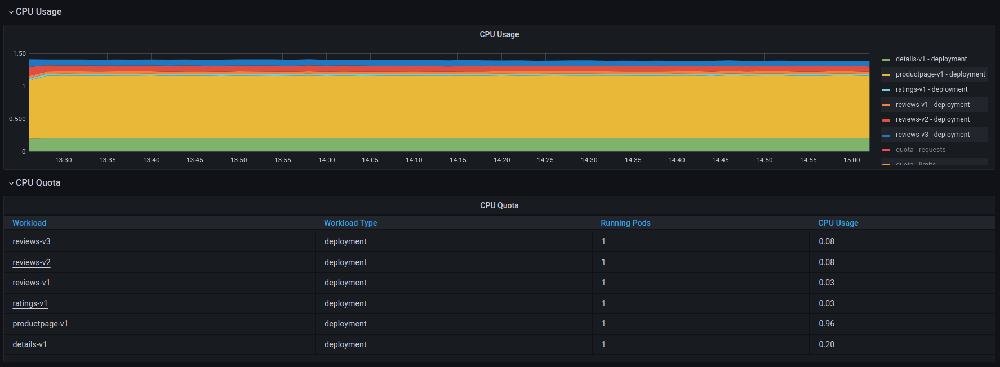 |
| Cilium       |    |
| Istio        | 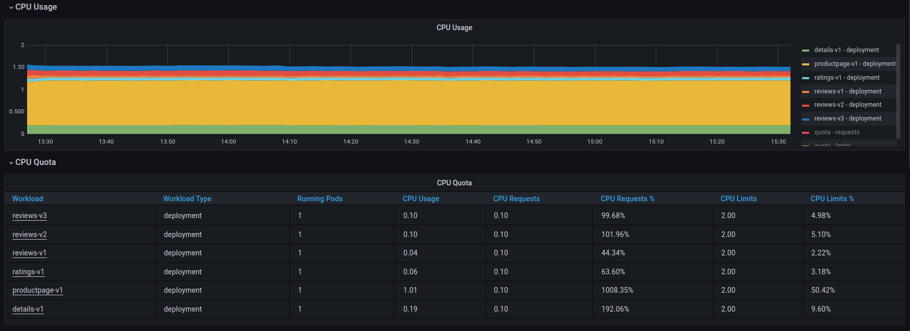    |
| Linkerd      | 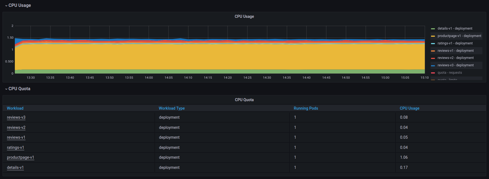  |

**Sidecar CPU Usage**

| Service Mesh | Sidecar CPU Usage                                                                   |
| ------------ | ----------------------------------------------------------------------------------- |
| Baseline     | N/A - Sidecars are not part of the Baseline implementation                          |
| Cilium       | N/A - Sidecars are not part of the Cillium implementation as Cilium uses daemonsets |
| Istio        | 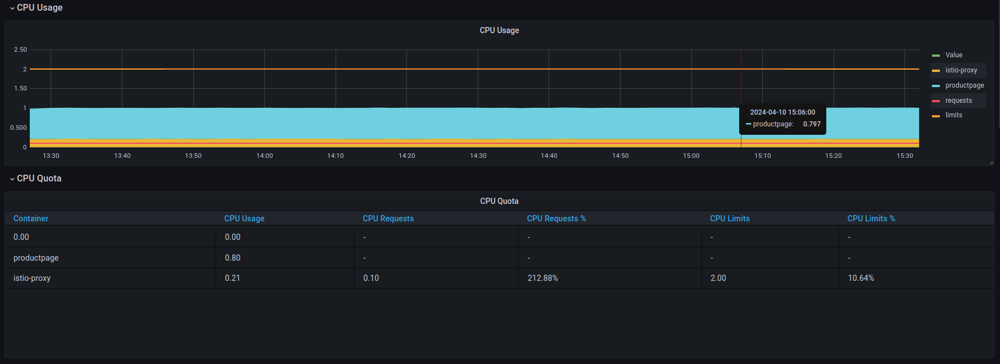                       |
| Linkerd      | 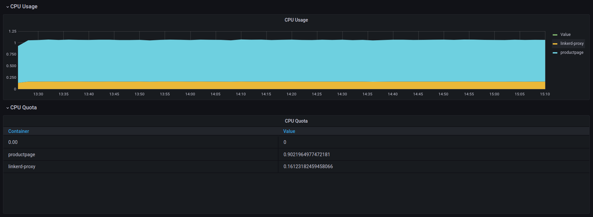                     |

**CNI CPU Usage**

| Service Mesh | CNI CPU Usage                                                                                                    |
| ------------ | ---------------------------------------------------------------------------------------------------------------- |
| Baseline     | 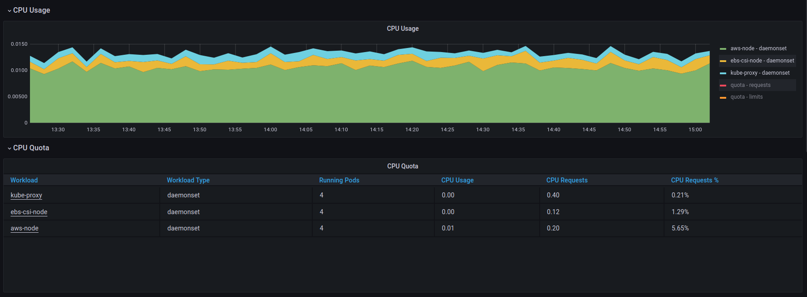                                                  |
| Cilium       | 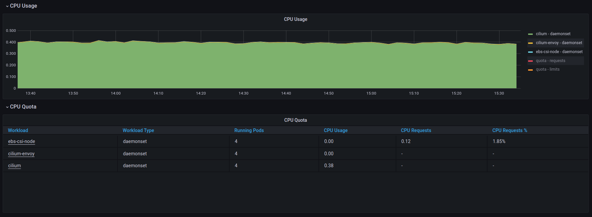                                                 |
| Istio        | N/A - AWS DS CPU usage in this cluster when performing the Istio tests was comparable to the Baseline cluster.   |
| Linkerd      | N/A - AWS DS CPU usage in this cluster when performing the Linkerd tests was comparable to the Baseline cluster. |

### VM to Ingress communication

**App CPU Usage**

| Service Mesh | App CPU Usage                                               |
| ------------ | ----------------------------------------------------------- |
| Baseline     | 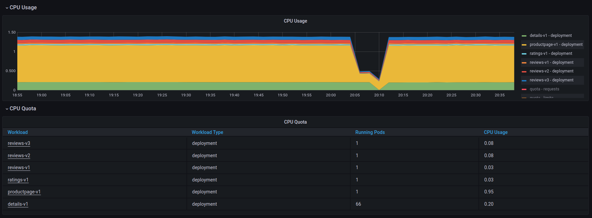 |
| Cilium       | 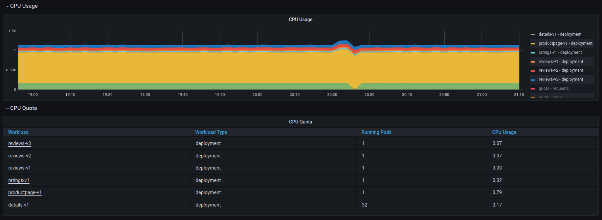   |
| Istio        |     |
| Linkerd      | 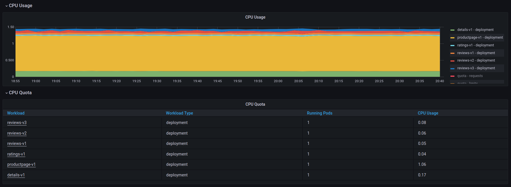  |

**Sidecar CPU Usage**

| Service Mesh | Sidecar CPU Usage                                                                   |
| ------------ | ----------------------------------------------------------------------------------- |
| Baseline     | N/A - Sidecars are not part of the Baseline implementation                          |
| Cilium       | N/A - Sidecars are not part of the Cillium implementation as Cilium uses daemonsets |
| Istio        | 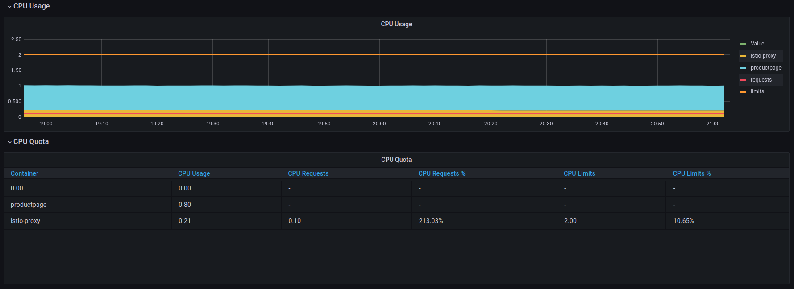                        |
| Linkerd      | 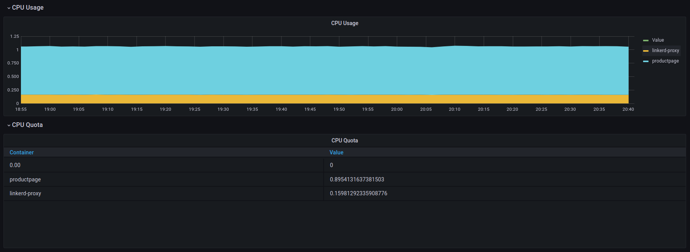                      |

**CNI CPU Usage(())

| Service Mesh | CNI CPU Usage                                                                                                    |
| ------------ | ---------------------------------------------------------------------------------------------------------------- |
| Baseline     | 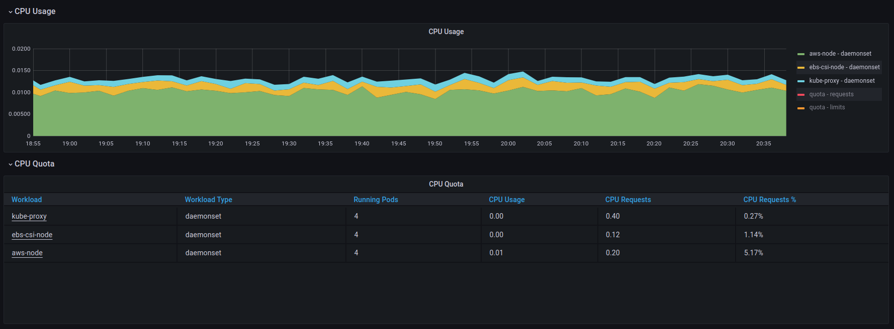                                                   |
| Cilium       | 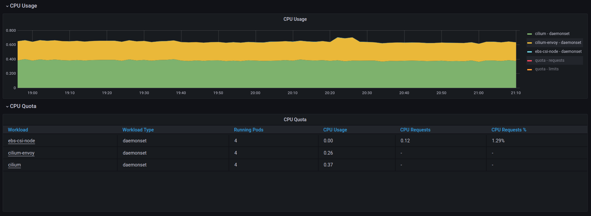                                                  |
| Istio        | N/A - AWS DS CPU usage in this cluster when performing the Istio tests was comparable to the Baseline cluster.   |
| Linkerd      | N/A - AWS DS CPU usage in this cluster when performing the Linkerd tests was comparable to the Baseline cluster. |

**Ingress Controller CPU Usage**

| Service Mesh | Ingress Controller CPU Usage                                                                                                          |
| ------------ | ------------------------------------------------------------------------------------------------------------------------------------- |
| Baseline     | 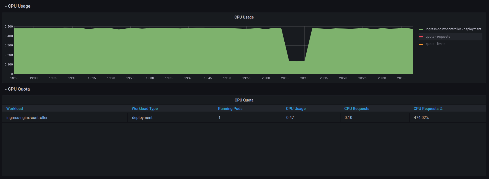                                                                       |
| Cilium       |  *Note: Cilium Envoy DaemonSet is responsible for the ingress traffic* |
| Istio        | 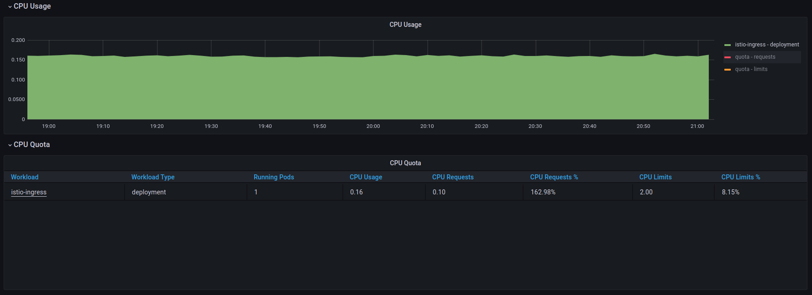                                                                          |
| Linkerd      | 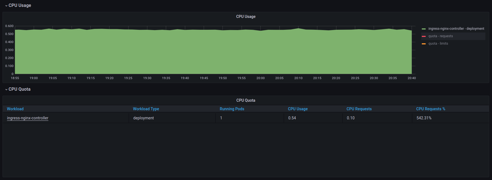                                                                        |

**Summary**

After reviewing the tables above, we can conclude that Linkerd consumes fewer resources and performs better than Istio for internal communications. However, when comparing Cilium and Linkerd, their resource consumption is similar while Linkerd's performance is better. In summary, Linkerd is the most performant service among the three, while Cilium provides good performance for low CPU usage and Istio provides good performance for higher CPU usage.

In terms of ingress traffic, Linkerd is strongly dependent on 3rd party controllers and shows the biggest CPU usage in combination with an ingress-nginx controller. Istio Ingress Controller shows the best results while Cilium falls somewhere in between.

## Operational Impact

The Operational Impact section outlines the efforts and potential impact of implementing each product. It provides information about the following areas:

- Prerequisites
- Product Integration
- Product Usability
- Support Contracts
- Upgrade cycle

### Cilium

**Prerequisites**

- [System Requirements](https://docs.cilium.io/en/stable/operations/system_requirements)
- `SPIRE` server *(can be installed using Cilium helm chart)*
- `PersistentVolumeClaim` support
- Ability to replace `kube-proxy`

For more information on the prerequisites and maintenance of the Cilium product, please refer to the Cilium section in the [Operational Manual Update document](operational-manual.md).

**Product Integration**

To use Cilium Service Mesh, you must also use Cilium CNI, which may require you to switch to a different CNI solution if you are currently using another one. In addition, to use the Cilium controller for Ingress traffic, you must replace the `kube-proxy` with Cilium, which adds another layer of migration.

To summarise the operational impact of implementing Cilium service mesh, it can have a significant impact on your environment if you have never used Cilium before. However, if you already have a Cilium setup in place, it requires enabling some flags and running a few checks to ensure everything is working as expected.

**Product Usability**

If you're using the Cilium Service Mesh, keep in mind that all traffic by default goes through Cilium controllers. All you have to do is configure traffic rules and start using Cilium controllers for ingress traffic. One of the benefits of Cilium is that you can use only the specific features that you need. For example, most users only need mTLS or encryption, and Cilium allows us to do this without a lot of effort.

**Support from Cloud providers**

In case you use managed Kubernetes clusters and want to implement Cilium Service Mesh, there may be support issues with your cloud provider, which is expected as it's not their software. In terms of cloud providers, main cloud providers like AWS, GKE and Azure have their own CNI solutions, although some of them are based on Cilium. Moreover, Azure has [Azure CNI Powered by Cilium](https://azure.microsoft.com/en-us/blog/azure-cni-with-cilium-most-scalable-and-performant-container-networking-in-the-cloud) and also supports [Isovalent Enterprise for Cilium](https://isovalent.com/blog/post/isovalent-cilium-enterprise-microsoft-azure-marketplace).

**Support Contracts**

Isovalent provides [Enterprise solution for Cilium](https://isovalent.com/blog/post/isovalent-enterprise-cilium-support-customer-environments)

**Upgrade Cycle**

It's important to know how often you need to upgrade your software, so below you can see the approximate interval of the releases.

- Minor release ~ few times a year
- Minor release support ~ 1 year
- Patch release ~ once a month

*Note: there is no accurate schedule, so all assumptions are based on previous releases*

**Summary**

If your environment uses Cilium CNI, then Cilium service mesh would be a suitable decision. All you need to do is update the configuration and create policies for meshed services. However, if your environment does not use Cilium CNI, then implementing Cilium service mesh can become a time-consuming and difficult process.

### Istio

**Prerequisites**

- [Istio Prerequisites document](https://istio.io/latest/docs/setup/platform-setup/prerequisites)

For more information on the prerequisites and maintenance of the Istio product, please refer to the Istio section in the [Operational Manual Update document](operational-manual.md).

**Product Integration**

To use Istio, you will need to install two helm charts. If you require an ingress controller, you can also install one more. Istio offers support for various ingress resources such as Ingress, Gateway API, and Istio Gateway, which simplifies the process of implementing a service mesh. To summarize, you need to install three Helm charts to introduce Istio to your cluster. After that, you can start meshing your services.

**Product Usability**

If you want to use Istio Service Mesh, you'll need to add sidecars to your pods. This can be done via labeling namespaces or direct container injection. The next step would be to configure ingress resources to mesh ingress traffic. Finally, you can configure policies and rules using different Istio CRs.

**Support Contracts**

Istio has a lot of 3rd party providers that can provide you with enterprise support and enterprise distribution of Istio. The most popular are [Tetrate](https://tetrate.io/tetrate-istio-subscription), [Solo.io](https://www.solo.io/istio-support) and [F5 Aspen Mesh](https://www.f5.com/products/aspen-mesh)

**Upgrade Cycle**

It's important to know how often you need to upgrade your software, so below you can see the approximate interval of the releases.

- Minor release ~ once every few months
- Minor release support ~ 6 months
- Patch release ~ once a month

*Note: there is no accurate schedule, so all assumptions are based on previous releases*

**Summary**

If you require a service mesh solution, Istio is a reliable option. It is easy to install, covers all use cases, and has clear documentation. However, it's worth noting that while it offers flexibility, it also comes with complexity, which may impact your operations.

### Linkerd

**Prerequisites**

- Linkerd prerequisites can be verified using [linkerd CLI](https://linkerd.io/2.14/reference/cli/check):
  - [The “pre-kubernetes-setup” checks](https://linkerd.io/2.14/tasks/troubleshooting/#pre-k8s)
  - [The “kubernetes-api” checks](https://linkerd.io/2.14/tasks/troubleshooting/#k8s-api)
  - [The “kubernetes-version” checks](https://linkerd.io/2.14/tasks/troubleshooting/#the-kubernetes-version-checks)
- [mTLS root certificates for helm installation](https://linkerd.io/2.15/tasks/install-helm/#prerequisite-generate-identity-certificates)

For more information on the prerequisites and maintenance of the Linkerd product, please refer to the Linkerd section in the [Operational Manual Update document](operational-manual.md).

**Product Integration**

To use Linkerd, you need to install two Helm charts and pre-create a set of resources for Trust Anchor. This set of resources can also be wrapped into a Helm chart, but you need to do it by yourself, which can complicate the process of introducing Linkerd to your cluster. It's essential to note that Linkerd doesn't have its own ingress controller and only supports mesh for Ingress resources. Gateway API is supported only on the level of custom Linkerd CRs for Gateway policies, so you can still use your Gateways, but you can't mesh traffic. However, you can integrate Linkerd easily with different ingress controllers to mesh traffic from Ingress resources.

**Product Usability**

If you want to use Linkerd Service Mesh, you'll need to add sidecars to your pods. This can be done via annotating namespaces or direct container injection. The next step would be to configure ingress resources to mesh ingress traffic. Finally, you can configure policies and rules using different Linkerd CRs. Keep in mind, that Linkerd requires some maintenance, all tasks are described in the [Operational Manual Update document](operational-manual.md).

**Support Contracts**

Buoyant provides [Buoyant Enterprise Linkerd](https://linkerd.io/enterprise) distribution and commercial support for it.

**Upgrade Cycle**

It's important to know how often you need to upgrade your software, so below you can see the approximate interval of the releases.

- Minor release ~ once a month
- Patch release ~ few times a month

*Note: there is no accurate schedule, so all assumptions are based on previous releases*

**Summary**

Linkerd is a good choice for those who prefer simplicity. Linkerd allows us to start using service mesh easily, but in a long-term perspective it requires some maintenance tasks, which should be considered before product integration.

## Iterate and Improve

In this section, we will be discussing how we have iterated and improved our testing as part of this process. Since we anticipated that we would need to run multiple iterations of tests, we adopted an iterative approach, analysing the results and making improvements to ensure reliable real-world results.

As part of the design document, we prepared a Test Approach, which aims to compare the performance of service meshes. However, when we have got our first results we noticed that the results were not accurate and weren't even similar to community service mesh comparisons. The thing that concerned us was a cluster with Linkerd installed faster than a Baseline cluster.

You can find the details of our improvements and failures in the tables below:

| Improvement                                    | Details                                                                                                                                                                                                                                                                                                                                                                                                                                     | Result                                                                                       |
| ---------------------------------------------- | ------------------------------------------------------------------------------------------------------------------------------------------------------------------------------------------------------------------------------------------------------------------------------------------------------------------------------------------------------------------------------------------------------------------------------------------- | -------------------------------------------------------------------------------------------- |
| Duration of tests - I001                       | The first iteration of tests included running oha commands with limited QPS for 3 minutes. We realised that 3 minutes it’s not enough because we have to include cloud faults, which can be noticed on small timeframes but are recovered on bigger timeframes, so the duration of tests was increased up to 30 minutes.                                                                                                                    | Result: Test output takes into account transient network issues.                             |
| Replace QPS with the number of requests - I002 | We removed the QPS limitation from the oha command. Although limiting QPS is a reliable choice, it requires more iterations of tests and provides more lab results rather than real-world results. Therefore, we decided to use an unlimited number of QPS to test the maximum performance of each product without overheating it. We changed -q argument in oha command to -n, which sets the number of requests that should be delivered. | New approach loads our environment correctly, without slamming products or overheating them. |
| Warm Up - I003                                 | During the first iteration of tests we noticed that the first test took longer to complete than all subsequent tests. It turned out, that after each test application restart we need to do a small warm-up of it. As a result, we added a few more tests, results of which are not included in the report.                                                                                                                                 | Results are more consistent.                                                                 |
| Test Applications - I004                       | We simplified test applications setup. We removed podinfo test application, as it doesn’t show the service mesh use case, because there is only one microservice. We also removed HA mode of bookinfo test applications, as it requires more iterations of tests and doesn’t show the significant difference in the results.                                                                                                                | Test run takes less time.                                                                    |
| Availability zone - I005                       | During the first iteration of tests we noticed that the results across environments are different even when the service mesh disabled, so we decided to minimise the difference between the environments and deploy all nodes in the same availability zone.                                                                                                                                                                                | Results become slightly better, but the difference is still big.                             |
| Region - I006                                  | After the second iteration of tests, when the results across environments are different even when the service mesh disabled, we decided to move from `eu-west-`2 to `us-east-1` as it’s the biggest and oldest AWS region.                                                                                                                                                                                                                  | The difference in results between the environments ranges from 3% to 5%.                     |
| Run tests concurrently - I007                  | To minimise the difference between the environments we decided to run tests concurrently.                                                                                                                                                                                                                                                                                                                                                   | Overall network load is consistent across all environments.                                  |

| Failure                                                                                           | Details                                                                                                         | Сonsequence                                                                              |
| ------------------------------------------------------------------------------------------------- | --------------------------------------------------------------------------------------------------------------- | ---------------------------------------------------------------------------------------- |
| VM (External Communication) test on 128 concurrent connections failed for two environments - F001 | Tests for Cilium and Baseline have failed due to a memory leak in the bookinfo app, that caused pod recreation. | It is not possible to include these results in the test report as they are not reliable. |

## Compliance

This section contains information on compliance and standards that your business may need to adhere to. The most widely used standard for service meshes is FIPS (140-2, 140-3), which outlines the security requirements a cryptographic module must meet. All tested products have FIPS-compliant versions, but the methods for achieving FIPS certification/validation vary.

### Linkerd

[Linkerd has FIPS-compliant](https://buoyant.io/fips-kubernetes-service-mesh) commercial distribution that is supported by Buoyant. Refer to the official website to review [Buoyant's offerings](https://buoyant.io).

### Cilium

[Cilium is FIPS-compliant](https://cilium.io/industries/security) but you may require [Isovalent Enterprise Support](https://isovalent.com/product) to achieve FIPS certification/validation.

### Istio

Istio supports FIPS-compliant builds. You can either build it by yourself (refer to the following GitHub Issues [Issue-001](https://github.com/istio/istio/issues/37118), [Issue-002](https://github.com/istio/istio/issues/11723)) or acquire FIPS-compliant build from 3rd party providers (refer to the [Support Contracts section](#istio-2) to get well-known Istio providers)

## Final Summary

To sum up, the tested products are all strong contenders, and choosing one over the others can be challenging as each product has advantages and disadvantages. However, we can provide some logic and recommendations to assist you in making the best decision.

Step one - Do I need a Service Mesh?

One of the most important things to consider before setting up a service mesh is determining whether you need it or only its specific features. Adding a service mesh will increase latency, complexity, and costs and may impact your operations overheads. Be certain to challenge the need for a Service Mesh before including it within your design.

Step two - Understand your current environment.

Once you know you need a mesh, you need to understand your environment and available resources to properly support it. For example, if you are running a cluster with the Cilium CNI, then the Cilium Service Mesh might be a suitable option due to its ease of deployment and maintenance. However, it's important to keep in mind the time and resources that will be required for configuration and maintenance. Cilium Service Mesh is linked to Cilium CNI and eBPF, which can provide exclusive features and performance, but it will take time for your team to understand and configure it properly.

Step three - Is performance more important than ease of maintenance?

Introducing a mesh introduces an additional technology that will need to be maintained. If your operations team is large, this may have little to no impact; however, most small- to medium-sized enterprises will need to consider this additional work in all existing maintenance and upgrade cycles.
If you are running a managed Kubernetes cluster, you probably need to look into Istio or Linkerd since there may be issues related to Cloud Support of Cilium CNI. Between these two, your choice can be dependent on compliance, support, or technical aspects. As we saw in the test results, Linkerd is the fastest mesh but requires more maintenance, such as routine tasks and small upgrade intervals. Moreover, [Buoyant announced a new model for stable releases](https://linkerd.io/2024/02/21/announcing-linkerd-2.15/#a-new-model-for-stable-releases), which can affect the upgrade cycle. Although Istio may not be the fastest or most performant mesh, it is widely used and offers solutions for various issues and use cases.

As the steps above show, no one size fits all, and all components of introducing a service mesh should be prioritised according to your situation and requirements. If you require help introducing a Service Mesh, you can reach out to LiveWyer and book a technical consultation at [livewyer.io](https://livewyer.io).

Finally, this table may help you choose the right mesh based on your number one priority requirement.

| Primary Requirement                 | Suggested Mesh                              |
| ----------------------------------- | ------------------------------------------- |
| Performance                         | No Mesh or Linkerd                          |
| Ease of Installation                | Cilium (if using Cilium CNI) or Istio       |
| Ease of Maintenance                 | Cilium (if using Cilium CNI) or Istio       |
| Compliance                          | All meshes have FIPS-compliant builds       |
| Reduced Cost & Resource Utilisation | Cilium or Linkerd                           |
| Available support contracts         | All meshes have available support contracts |
